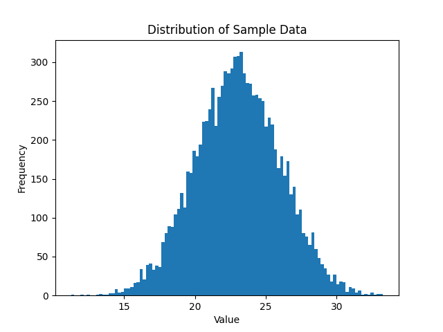

# Problem 2 Written Answers

by Shaurya Gaur

## Consider the data set below. Write some python code that illustrates some common feature engineering and/or data preparation tasks.

Both of the links provided to access the dataset returned 404 errors, so I did not have any data to prepare or do feature engineering for. However, considering the links point to CSVs, here are a few things that I would consider doing, utilizing Pandas:

-   Examine dimensions of the data and learn about the meaning of each feature.
-   Examine null values in the data and either:
    -   Try to impute with the mean of the values (if it is a numerical feature).
    -   If the feature has too many null values, remove the feature.
    -   If there are only a few null values for that feature, remove those examples.
-   Use a `seaborn` pairplot to pair all features against each other to understand relationships between them.
-   Use `scikit-learn`'s `RandomForestClassifier` to find the features with the most cardinality, and potentially the most importance.
-   Use `scikit-learn`'s `StandardScaler` to normalize numerical features where appropriate.
-   If there are categorical features, either convert them to one-hot columns or, if they're sequential, map them in an order that makes sense.
    -   An example of the latter would be mapping `["freshman", "sophomore", "junior", "senior"]` to `[1,2,3,4]`.

## Describe data.csv

It seems like data.csv contains a normally distributed dataset, not skewed in any way, as seen by the image below. In addition, the statistics (generated using pandas DataFrame's built-in describe() function, but can also be easily computed using functions from `numpy` and `statistics`), show that the mean and median are almost the same - a good sign that there is no skew. The standard deviation is around 3, and the quartiles are evenly spaced from the median.

```
count  10000.000000
mean      23.036075
std        2.995296
min       11.248686
25%       21.007801
50%       23.024042
75%       25.069083
max       33.286533
```


